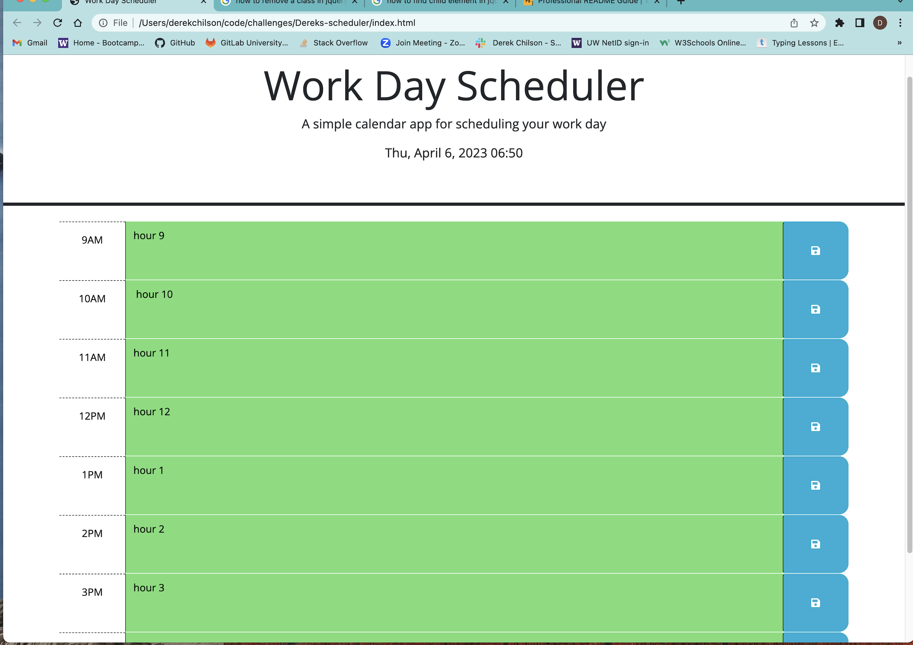

# Dereks-scheduler
## Description
This project already had some HTML and CSS so had to change the HTML and add JavaScript with Jquery and dayJs. The HTML I added data attributes to each div block changing to military time so the scheduler would know that 9am is less than 1pm in terms of the html id hour-9 not saying AM or PM. Made a if else loop so that when the current time changes on hte hour each block will change to the right color. Also added local storage so it will keep the information on the page in the present and future to read. I had some hard times with this getting words on paper, but Andres (tutor) helped me tweek some things to get the functions working. He also helped me find the right words on how to google things to make more sense. I am still learning every project I do and it's getting just slightly easier to make sense of the functions and variable and how they work together.

## Credits

List your collaborators, if any, with links to their GitHub profiles.

If you used any third-party assets that require attribution, list the creators with links to their primary web presence in this section.

If you followed tutorials, include links to those here as well.

## License

The last section of a high-quality README file is the license. This lets other developers know what they can and cannot do with your project. If you need help choosing a license, refer to [https://choosealicense.com/](https://choosealicense.com/).

---

🏆 The previous sections are the bare minimum, and your project will ultimately determine the content of this document. You might also want to consider adding the following sections.

## Badges

Badges aren't necessary, per se, but they demonstrate street cred. Badges let other developers know that you know what you're doing. Check out the badges hosted by [shields.io](https://shields.io/). You may not understand what they all represent now, but you will in time.

## Features

If your project has a lot of features, list them here.

## How to Contribute

If you created an application or package and would like other developers to contribute it, you can include guidelines for how to do so. The [Contributor Covenant](https://www.contributor-covenant.org/) is an industry standard, but you can always write your own if you'd prefer.

## Tests

Go the extra mile and write tests for your application. Then provide examples on how to run them here.