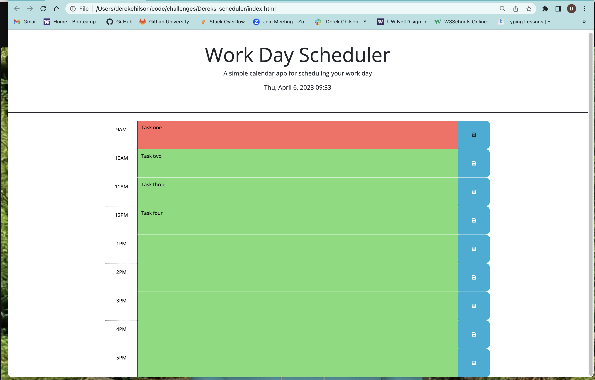
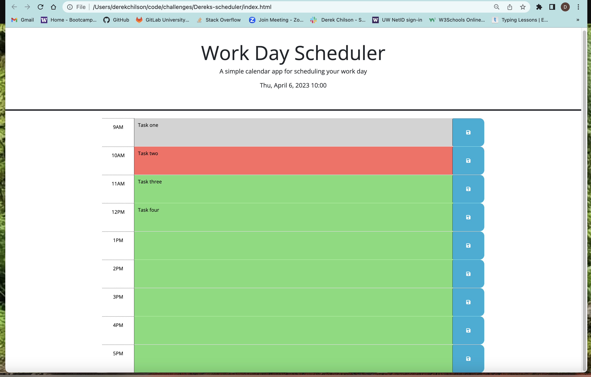

# Dereks-scheduler

## Description
This project already had some HTML and CSS so had to change the HTML and add JavaScript with Jquery and dayJs. The HTML I added data attributes to each div block changing to military time so the scheduler would know that 9am is less than 1pm in terms of the html id hour-9 not saying AM or PM. Made a if else loop so that when the current time changes on hte hour each block will change to the right color. Also added local storage so it will keep the information on the page in the present and future to read. I had some hard times with this getting words on paper, but Andres (tutor) helped me tweek some things to get the functions working. He also helped me find the right words on how to google things to make more sense. I am still learning every project I do and it's getting just slightly easier to make sense of the functions and variable and how they work together.

this is a link directly to the project:
https://derekchili.github.io/Dereks-scheduler/

The first screenshot shows before the time starts and all colors being the future in green.
The second screenshot shows with the hour starting and the present time being red.
The third screenshot shows all three time colors being displayed.

## Credits
Had a classmate Joel post something about $(this) so I googled that and got me started on the save button portion of the function to start the project. Andres Jiminez the Tutor helped me tweek some things I had started and had me google and firgure things out so it made sense to me. Used Google, then some slackOverflow to see some examples. And Jquery website to find answers like how to add or remove classes in Jquery.

